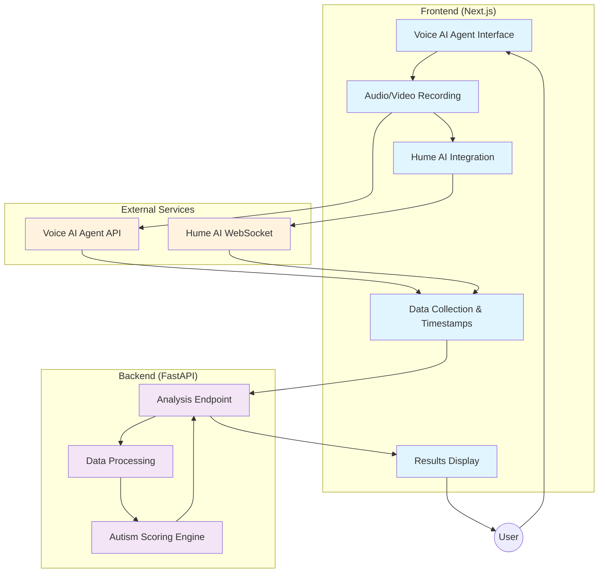

# Voice AI Agent Architecture with Autism Analysis

## System Architecture Diagram



## Simplified Flow Description

### Step 1: Interview & Data Collection
1. **Voice AI Agent Interview**: User interacts with AI agent for structured conversation
2. **Multi-Modal Recording**: Capture audio/video with real-time Hume AI emotion analysis
3. **Timestamped Collection**: Collect conversation transcript + emotion data with timestamps

### Step 2: Send to Backend
1. **Data Package**: Frontend packages conversation data + Hume emotion timeline
2. **POST to /analyze**: Single API call sends all collected data to backend

### Step 3: Analysis & Response
1. **Process Data**: Backend processes conversation + emotion patterns
2. **Generate Score**: Autism scoring engine calculates likelihood score
3. **Return Results**: Backend responds with analysis results and statistics
4. **Display Results**: Frontend shows autism score and insights to user

## Data Models

### Conversation Data
```typescript
interface ConversationData {
  sessionId: string;
  transcript: TranscriptSegment[];
  duration: number;
  startTime: Date;
  endTime: Date;
}

interface TranscriptSegment {
  timestamp: number;
  speaker: 'user' | 'agent';
  text: string;
  confidence: number;
}
```

### Emotion Timeline
```typescript
interface EmotionTimeline {
  sessionId: string;
  faceEmotions: TimestampedEmotion[];
  prosodyEmotions: TimestampedEmotion[];
  burstAnalysis: VocalBurst[];
}

interface TimestampedEmotion {
  timestamp: number;
  emotions: Emotion[];
  confidence: number;
}
```

### Analysis Results
```typescript
interface AutismAnalysisResult {
  sessionId: string;
  overallScore: number;
  confidence: number;
  indicators: {
    socialCommunication: number;
    restrictedInterests: number;
    sensoryProcessing: number;
    emotionalRegulation: number;
  };
  timeline: AnalysisPoint[];
  recommendations: string[];
}
```
